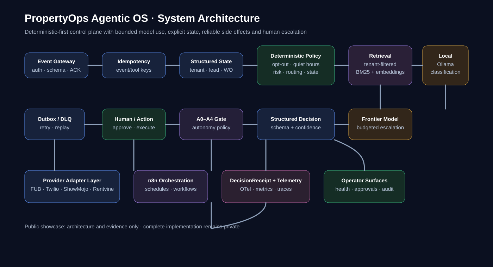
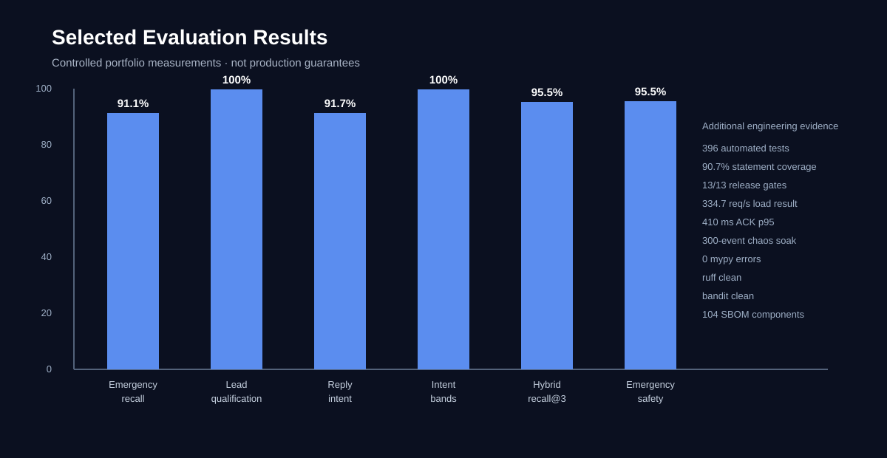

# PropertyOps Agentic OS

### Deterministic-first agent architecture for 24/7 residential property operations

<p align="center">
  
</p>

<p align="center">
  <a href="https://propertyops-agentic-os.streamlit.app/">Live Demo</a>
  &nbsp;·&nbsp;
  <a href="https://github.com/hmzainjamil/propertyops-agentic-os-showcase">Public Showcase</a>
</p>

<p align="center">
  
  
  
  
</p>

PropertyOps Agentic OS is a hands-on engineering portfolio project for building a reliable agentic operating layer across CRM, messaging, leasing, maintenance and operational workflows.

> **Core design principle:** use ordinary software for decisions that can be deterministic. Use an LLM only when reasoning or classification is actually needed.

**Status:** Portfolio / controlled sandbox  
**Live system:** https://propertyops-agentic-os.streamlit.app/  
**Public showcase:** https://github.com/hmzainjamil/propertyops-agentic-os-showcase  
**Full implementation:** private source repository

> **Scope:** The public repository is documentation and evidence only. It does not contain the complete implementation, credentials, production secrets, customer data or private evaluation assets.

---

## Contents

- [Why this project](#why-this-project)
- [At a glance](#at-a-glance)
- [Architecture](#architecture)
- [Capability coverage](#capability-coverage)
- [How the system decides](#how-the-system-decides)
- [State, memory and context](#state-memory-and-context)
- [Reliability and failure recovery](#reliability-and-failure-recovery)
- [Governance, safety and compliance controls](#governance-safety-and-compliance-controls)
- [Integrations and orchestration](#integrations-and-orchestration)
- [Operator and engineering surfaces](#operator-and-engineering-surfaces)
- [Measured evidence](#measured-evidence)
- [Audit-driven development](#audit-driven-development)
- [Quality and security posture](#quality-and-security-posture)
- [What is real vs mocked](#what-is-real-vs-mocked)
- [Designed extension paths](#designed-extension-paths)
- [Repository structure](#repository-structure)
- [Production boundary](#production-boundary)
- [Technical review](#technical-review)

---

## Why this project

A basic automation often looks like:

```text
Trigger -> Send full customer history to GPT -> Response -> Next node
```

This project explores a different pattern:

```text
Event
  -> State
  -> Deterministic logic
  -> Targeted retrieval
  -> Model only when needed
  -> Validated action
  -> State update
  -> Next action
```

The architecture keeps state, safety-critical decisions and side effects under explicit software control. Models are bounded components rather than the source of truth for the entire workflow.

---

## At a glance

| Area | Approach |
|---|---|
| Runtime | Python, FastAPI, Streamlit, Docker |
| State | Tenant / prospect state, versioned transitions, compare-and-swap |
| Data | SQLite in the portfolio environment |
| Models | Ollama qwen2.5:7b, hosted fallback path for controlled evaluation, budgeted frontier escalation |
| Retrieval | Hybrid BM25 + embedding retrieval with tenant filtering |
| Orchestration | Core workflow engine plus n8n workflow designs |
| Integrations | Follow Up Boss, Twilio, ShowMojo, Rentvine adapter contracts |
| Reliability | Idempotency, outbox, retries, DLQ, replay, reconciliation, circuit breaker |
| Governance | A0-A4 autonomy tiers, human approval, DecisionReceipt audit trail |
| Observability | OpenTelemetry, Prometheus metrics, traces and alert rules |
| Evaluation | Unit, property-based, API contract, fault, chaos, load and adversarial testing |

---

## Architecture

### Control loop

```text
Provider / UI Event
       |
       v
Authenticate + validate
       |
       v
Idempotency / event status
       |
       v
Load structured state
       |
       +-----------------------------+
       |                             |
       v                             v
Deterministic rules             Targeted retrieval
       |                             |
       |                             v
       |                        Local model
       |                             |
       |                     +-------+-------+
       |                     |               |
       |                     v               v
       |                  Accept         Frontier
       |                                     |
       +------------------+------------------+
                          v
                  Structured decision
                          |
                          v
                    A0-A4 policy gate
                       /          \
                      /            \
               Human approval    Validated action
                      \            /
                       v          v
                  Action / outcome
                          |
                          v
                 Outbox / retry / DLQ
                          |
                          v
              DecisionReceipt + telemetry
                          |
                          v
                     State update
```

<p align="center">
  
</p>

### Architecture layers

| Layer | Responsibility |
|---|---|
| Event gateway | Authentication, schema validation, rate limiting and fast acknowledgement |
| State | Tenant, lead, work-order and workflow state with version checks |
| Policy | Deterministic routing, safety, consent and compliance rules |
| Retrieval | Tenant-filtered context retrieval |
| Model router | Local, fallback and frontier model selection |
| Action layer | Bounded tools, provider adapters and side-effect controls |
| Governance | A0-A4 autonomy and human approval |
| Reliability | Outbox, retries, DLQ, replay and reconciliation |
| Observability | Traces, metrics, ledgers and health views |

---

## Capability coverage

The private implementation is broader than the public repository. This table separates what is built from what is designed or still requires external integration.

| Capability | Status | Scope |
|---|---|---|
| Lead intake | Built | Webhook intake, validation, deduplication and state creation |
| Lead qualification | Built | ICP scoring, intent bands and policy-aware routing |
| Outreach | Built | Template baseline plus bounded model drafting |
| Reply handling | Built | Intent, opt-out, objection and escalation routing |
| Stalled lead recovery | Built | Scheduled scanner and reactivation logic |
| Appointment workflow | Built | Meeting offered and booked states |
| Maintenance intake | Built | Tenant message intake and work-order creation |
| Emergency triage | Built | Rule-first hazard detection with fail-safe escalation |
| Vendor dispatch | Built | Adapter contract, retry and acknowledgement path |
| Work-order follow-through | Built | Timeline, timeout escalation and reconciliation |
| Human approvals | Built | Approval queue, timeout escalation and audit trail |
| Tenant setup | Built | Tenant-scoped configuration and onboarding |
| Analytics | Built | Funnel, compliance, health and modeled unit-economics views |
| Reliability center | Built | DLQ, circuit state, backlog and reconciliation |
| Decision explorer | Built | DecisionReceipt and policy-path inspection |
| Tracing | Built | Redacted traces plus model and tool ledgers |
| Compliance controls | Built | Opt-out, quiet hours, frequency caps, consent and suppression |
| Shadow ML | Built | Synthetic-data ranking model; shadow only |
| n8n workflows | Designed | W01 webhook intake, W04 stalled scanner, W05 error handler |
| Real provider E2E | Not yet | Sandbox credentials and provider contract validation required |
| BricksFolios platform integration | Not yet | Node.js / MongoDB / RDS boundary documented, not integrated |
| Production customer data | Not used | Synthetic or controlled evaluation data |

See [CAPABILITIES.md](CAPABILITIES.md).

### Representative end-to-end scenario

For a tenant reporting water through a ceiling at 11:30 PM, the intended control flow is:

```text
Tenant message
  -> authenticate tenant
  -> load property / work-order context
  -> deterministic emergency check
  -> fail-safe escalation if uncertain
  -> create / update work order
  -> notify tenant
  -> dispatch vendor once
  -> wait for acknowledgement
  -> retry / re-dispatch if needed
  -> human takeover after escalation threshold
  -> reconcile property-management state
  -> record DecisionReceipt
```

---

## How the system decides

The system asks one question before using a model:

**Does this actually require an LLM?**

| Decision | Preferred mechanism |
|---|---|
| Webhook authentication | Deterministic code |
| Idempotency / duplicate detection | Deterministic code |
| Opt-out / suppression | Deterministic rules |
| Quiet hours / frequency caps | Deterministic rules |
| Emergency safety checks | Deterministic rules first |
| Workflow state transitions | State machine |
| Knowledge lookup | Retrieval |
| Simple reply intent | Local model or deterministic rules |
| Ambiguous classification | Local model, then stronger model if justified |
| Complex research / reasoning | Frontier model |
| High-risk or unresolved exception | Human escalation |

### Model routing policy

The current model router is layered:

1. Rules decide first and can complete a decision with zero model tokens.
2. Local Ollama qwen2.5:7b is the primary model for lightweight classification when available.
3. A hosted free-model fallback can support controlled synthetic evaluation when Ollama is unavailable.
4. Invalid model output is retried once, then routed to an alternate path.
5. Frontier reasoning is used only when policy and the per-tenant budget allow it.
6. Current confidence policy accepts local classification at or above 0.70 and frontier classification at or above 0.50; otherwise it escalates.
7. Model provider, version, token usage, latency and cost are recorded.
8. Prompt or model changes require the evaluation run to be repeated and the result delta recorded.

The documented default frontier budget is modeled at $0.50 per tenant per day. This is an engineering control for the portfolio system, not a production pricing claim.

---

## State, memory and context

The system does not repeatedly send complete customer histories to a model.

Structured state includes:

- lifecycle stage
- recent meaningful events
- consent and suppression
- open work orders
- risk flags
- ICP and intent
- current objective
- next action
- provider identifiers
- state version

Core records separate:

- inbound events
- leads
- lead events
- transitions
- tool calls
- model calls
- approvals
- DLQ items
- work orders
- traces
- suppression records

Retrieval is tenant-filtered and only relevant context is assembled for the current decision.

---

## Reliability and failure recovery

The system assumes events and provider calls can fail, repeat or complete partially.

Implemented controls include:

- unique event and tool idempotency keys
- reprocessable event status
- compare-and-swap state versions
- bounded retries with backoff and jitter
- outbox processing
- dead-letter queue and replay
- reconciliation after replay
- circuit breaker
- approval timeouts
- fallback escalation
- webhook ACK before background work
- rate limiting
- provider-side duplicate accounting
- fault injection
- chaos soak testing

The private project also includes diagnostics for duplicate messages, stuck leads, invalid model output, rising frontier usage, webhook failures and growing escalation backlog.

See [ARCHITECTURE.md](ARCHITECTURE.md).

---

## Governance, safety and compliance controls

### A0-A4 autonomy

| Tier | Role |
|---|---|
| A0 | Human decision required |
| A1 | Assistive / low-risk action |
| A2 | Bounded autonomous workflow |
| A3 | Higher autonomy within explicit guardrails |
| A4 | Highest configured autonomy; irreversible or high-risk actions require human control |

Material AI and tool actions can produce an immutable DecisionReceipt.

### Deterministic safety controls

Technical controls include:

- STOP / unsubscribe suppression
- quiet-hours enforcement
- frequency caps
- sender identification
- webhook signature verification
- Twilio signature verification
- high-risk maintenance routing
- irreversible-action blocking
- consent-aware messaging decisions
- retention / erasure mechanisms
- PII redaction in traces
- human approval on high-risk paths

The technical compliance matrix is self-assessed and explicitly not legal sign-off.

---

## Integrations and orchestration

### Provider adapter layer

Contracts exist for:

- Follow Up Boss
- Twilio
- ShowMojo
- Rentvine
- n8n

The portfolio environment uses mocked provider behaviour. Real sandbox credentials and provider contract tests are still required.

### n8n boundary

n8n is treated as an orchestration layer, not the source of truth for core business logic.

Documented workflows include:

- **W01** webhook intake
- **W04** stalled-lead scanner
- **W05** error handling / DLQ workflow

State transitions, policies, idempotency and safety remain in application code.

---

## Operator and engineering surfaces

The live Streamlit application exposes operational views for:

- overview
- leads
- replies
- maintenance
- approvals
- decisions
- evaluations
- failures
- health
- reliability
- traces
- analytics
- tenant setup

The application is intended to make the system inspectable, not just demonstrable.

---

## Measured evidence

<p align="center">
  
</p>

| Metric | Result | Context |
|---|---:|---|
| Automated tests | **396** | Unit, property, API, workflow, fault and regression suites |
| Statement coverage | **90.7%** | propertyops package |
| Release gates | **13/13** | Portfolio release gate |
| Emergency recall | **0.911** | Frozen out-of-sample rules test |
| Emergency false-emergency rate | **0.114** | Same frozen test |
| Emergency safety | **239/239** | Tested emergencies avoided the routine reply path |
| Reply intent accuracy | **0.917** | Hand-written evaluation using local Ollama |
| Deterministic reply decisions | **62.5%** | Evaluation decisions completed without a model call |
| Hybrid retrieval recall@3 | **0.955** | 26 labelled queries |
| Lead qualification | **1.0** | 100-example held-out evaluation |
| Intent-band classification | **1.0** | 100-example held-out evaluation |
| Load | **334.7 req/s** | Real uvicorn, 600 requests, concurrency 50 |
| ACK p95 | **410 ms** | Same load test |
| Chaos soak | **300 events** | 250 processed, 0 invariant violations in documented run |
| mypy | **0 errors** | Current check |
| ruff | **clean** | Current check |
| bandit | **clean** | Current check |
| Dependency scan | **0 high/critical engine findings** | Current pip-audit result |
| SBOM | **104 components** | Current scorecard |

These are controlled engineering measurements. They are not production guarantees.

See [EVIDENCE.md](EVIDENCE.md).

---

## Audit-driven development

The project was deliberately subjected to an adversarial hard audit designed to break the original assumptions.

Early findings included:

- unsigned webhook acceptance
- emergency-rule overfitting
- lost leads after mid-flight failure
- opt-out handling defects
- false opt-out handling
- duplicate emergency dispatch
- tenant identity spoofing
- incomplete approval paths
- simulator fail-open behaviour
- partial-success state inconsistencies

Those findings were converted into fixes and regression tests.

The engineering value is the failure-and-remediation loop, not a claim that the first version was perfect.

See [AUDIT.md](AUDIT.md).

---

## Quality and security posture

The private project includes:

- Pydantic boundary validation
- HMAC / signed webhook verification
- Twilio signature verification
- rate limiting
- PII redaction
- consent and suppression controls
- retention and erasure mechanisms
- model and tool ledgers
- OpenTelemetry instrumentation
- Prometheus-format metrics and alert rules
- Docker packaging
- static analysis
- dependency scanning
- SBOM generation
- fault injection and adversarial testing

No independent security certification or penetration-test sign-off is claimed.

---

## What is real vs mocked

### Implemented in the private project

- core event engine
- structured state
- deterministic routing and policies
- local Ollama integration
- hybrid retrieval
- shadow ML evaluation
- FastAPI webhook service
- OpenTelemetry
- Docker packaging
- evaluation framework
- operator UI
- workflow and reliability controls

### Mocked or design-only

- Follow Up Boss provider behaviour
- Twilio provider behaviour
- ShowMojo provider behaviour
- Rentvine provider behaviour
- frontier provider
- n8n deployment
- production-scale Postgres / Redis topology
- real customer data
- BricksFolios proprietary platform

This distinction is deliberate so the showcase remains accurate about what has and has not been validated with real external systems.

---

## Designed extension paths

The architecture has documented reuse paths for workflows not fully implemented against real providers:

| Workflow | Reuses | Additional work |
|---|---|---|
| Leasing | Lead state, policy, tools, KB | ShowMojo scheduling adapter and reminders |
| Rent / delinquency | State machine, policy, consent | Ledger adapter and payment-plan approval |
| Lease renewals | Timers, templates, state | PM-system dates and renewal adapter |
| Inspections | Timers, work-order patterns | Inspection data adapter |
| Short-term rentals | Maintenance flow and alerts | Booking / cleaning adapters |
| Owner communications | Approval console and templates | Work-order summarisation adapter |

These are architecture extension paths, not claims of completed production integrations.

---

## Repository structure

The public repository is intentionally small and reviewable:

```text
.
├── README.md
├── CAPABILITIES.md
├── ARCHITECTURE.md
├── EVIDENCE.md
├── AUDIT.md
├── LIMITATIONS.md
└── assets/
    ├── system-architecture.svg
    └── evaluation-results.svg
```

The complete implementation, tests, datasets, model registry, deployment configuration and internal documentation remain in the private source repository.

---

## Production boundary

This project is a serious engineering portfolio artifact and controlled sandbox design. It is **not** a production-certified property-management platform.

Before real production use, it still needs:

1. Real sandbox testing with Follow Up Boss, Twilio, ShowMojo and Rentvine
2. Integration with the target Node.js / MongoDB / RDS platform
3. Independent penetration testing and security review
4. Human-labelled production-like evaluation data
5. Production Postgres / Redis deployment and recovery testing
6. Deployed telemetry collection and real alert routing
7. Jurisdiction-specific legal and compliance review
8. Real customer-data governance and operational SLOs

See [LIMITATIONS.md](LIMITATIONS.md).

---

## Technical review

A serious technical review can cover:

- architecture and state transitions
- model routing and token efficiency
- retrieval and context assembly
- safety and autonomy controls
- idempotency and failure recovery
- evaluation methodology and held-out testing
- adversarial audit findings and remediation
- what is built versus mocked

### Live demo

https://propertyops-agentic-os.streamlit.app/

### Public showcase

https://github.com/hmzainjamil/propertyops-agentic-os-showcase

### Full source

The complete implementation remains private and can be made available for controlled technical evaluation.

---

## Scope statement

This public repository documents the architecture and engineering evidence of PropertyOps Agentic OS.

It intentionally does not expose the complete implementation.

It should be reviewed as an engineering artifact, not mistaken for production certification.
