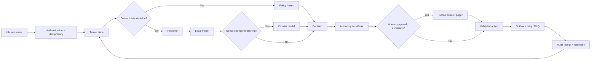

# PropertyOps Agentic OS

## Public Technical Showcase

PropertyOps Agentic OS is a production-minded agent architecture for residential property operations, focused on lead handling, maintenance triage, deterministic-first automation, selective LLM use, safety, auditability, and human escalation.

This repository is a **public showcase only**. The full implementation remains private. No production secrets, provider credentials, customer data, or complete source code are included here.

## Why this project

The core design principle is simple:

> Use deterministic software for decisions that can be made deterministically. Use an LLM only when reasoning or classification is actually needed.

```text
Event
  -> State
  -> Deterministic policy / rules
  -> Retrieval when needed
  -> Model when needed
  -> Action
  -> Validation
  -> State update
  -> Next action
```

## Architecture at a glance



## Engineering focus

| Area | Design approach |
|---|---|
| Workflow control | Deterministic-first state machines and policy gates |
| Model usage | Local model for lighter classification, stronger model only when needed |
| Safety | Hazard triage, fail-safe escalation, autonomy tiers A0-A4 |
| Reliability | Idempotency, outbox processing, retries, dead-letter queue, replay and reconciliation |
| Multi-tenancy | Tenant-scoped state, identity checks and isolated configuration |
| Auditability | Immutable DecisionReceipt records for decisions and actions |
| Integrations | Provider adapter contracts for Follow Up Boss, Twilio, ShowMojo, Rentvine and n8n designs |
| Observability | OpenTelemetry, metrics, traces and operational dashboards |
| Evaluation | Unit, property-based, API contract, fault-injection, chaos and load testing |

## Measured evidence

The internal engineering scorecard records the following after remediation:

- **396 automated tests**
- **90.7% statement coverage** for the `propertyops/` package
- **13/13 release gates passed**
- **0.911 emergency recall** on the frozen out-of-sample rules test
- **1.0 system-level safety result** for emergency messages avoiding the routine reply path across 239 tested messages
- **0.917 reply-intent accuracy** on the documented hand-written evaluation set using the recorded local Ollama run
- **334.7 requests/second** in the documented real-uvicorn load test at concurrency 50

These are engineering test results from synthetic or controlled evaluation data. They are not production performance guarantees.

## What is real vs mocked

### Implemented

- Core event engine
- State management
- Deterministic routing and policy logic
- Local Ollama integration
- Hybrid retrieval
- Synthetic ML shadow model
- FastAPI webhook service
- OpenTelemetry instrumentation
- Docker build
- Evaluation and fault-injection framework
- Operator UI

### Mocked or design-only

- Follow Up Boss provider behaviour
- Twilio provider behaviour
- ShowMojo provider behaviour
- Rentvine provider behaviour
- Frontier model provider
- n8n deployment
- Production-scale Postgres/Redis topology
- Production customer data

The project does **not** claim production certification, enterprise security certification, legal approval, or real-provider E2E validation.

## Audit-driven development

The project went through an adversarial hard audit that deliberately tried to break the system. Findings included webhook authentication gaps, emergency-rule overfitting, lost-lead paths, opt-out handling defects, duplicate side effects, tenant identity spoofing, approval dead ends, and simulator fail-open behaviour.

Those findings were converted into fixes and regression tests. The audit is part of the project because the failures are as important as the final architecture.

## Technical evaluation

The full source implementation is kept private because the implementation itself is part of the portfolio work.

For a serious technical evaluation, I can provide controlled source access and walk through:

1. Architecture and state transitions
2. Safety and escalation logic
3. Idempotency and failure handling
4. Evaluation methodology and held-out tests
5. Audit findings and remediation
6. Tradeoffs and what I would change next

## Public materials

- [Architecture](ARCHITECTURE.md)
- [Evidence and measurements](EVIDENCE.md)
- [Limitations and production gaps](LIMITATIONS.md)

## Live review

- Live system: https://propertyops-agentic-os.streamlit.app/
- Public showcase repository: https://github.com/hmzainjamil/propertyops-agentic-os-showcase

The public repository is intentionally documentation-only. The complete implementation remains private.
