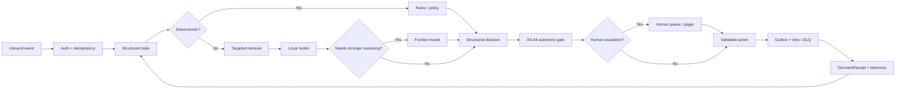

# PropertyOps Agentic OS

### Deterministic-first agent architecture for residential property operations

PropertyOps Agentic OS is an engineering portfolio project exploring how a 24/7 property-operations layer can combine deterministic software, local LLMs, retrieval, structured state, reliable integrations, and human escalation without sending entire customer histories to a model on every step.

> **Core design principle:** use ordinary software for decisions that can be deterministic. Use an LLM only when reasoning or classification is actually needed.

**Status:** Portfolio / controlled sandbox  
**Live system:** https://propertyops-agentic-os.streamlit.app/  
**Public repository:** https://github.com/hmzainjamil/propertyops-agentic-os-showcase

> **Scope note:** This repository is a public technical showcase. The complete implementation remains private. No production secrets, provider credentials, customer data, or full source code are included here.

---

## Contents

- [At a glance](#at-a-glance)
- [Architecture](#architecture)
- [How the system thinks](#how-the-system-thinks)
- [Engineering controls](#engineering-controls)
- [Measured evidence](#measured-evidence)
- [Implemented vs mocked](#implemented-vs-mocked)
- [Audit-driven development](#audit-driven-development)
- [Repository structure](#repository-structure)
- [Production gaps](#production-gaps)
- [Technical review](#technical-review)

---

## At a glance

| Concern | Approach |
|---|---|
| Workflow | Deterministic-first state machines and policy gates |
| Context | Structured tenant / prospect state plus targeted retrieval |
| Model routing | Local model for lighter tasks, stronger model only when justified |
| Safety | Hazard triage, autonomy tiers A0-A4, human escalation |
| Reliability | Idempotency, outbox, retries, DLQ, replay, reconciliation |
| Integrations | Adapter contracts for Follow Up Boss, Twilio, ShowMojo, Rentvine and n8n designs |
| Observability | OpenTelemetry, metrics, traces and operational dashboards |
| Auditability | Immutable DecisionReceipt records |
| Evaluation | Unit, property-based, API contract, fault-injection, chaos and load testing |

---

## Architecture

The system follows an event-driven loop:

```text
Event
  ↓
Authentication + idempotency
  ↓
Structured state
  ↓
Deterministic policy / rules
  ↓
Retrieval when needed
  ↓
Model only when needed
  ↓
Structured decision
  ↓
Autonomy / human-approval gate
  ↓
Validated action
  ↓
Outbox / retry / DLQ
  ↓
Decision receipt + telemetry
  ↓
State update
```

### Architecture at a glance



---

## How the system thinks

The architecture is designed around a simple question at every step:

**Does this actually require an LLM?**

Examples:

| Decision | Preferred mechanism |
|---|---|
| Webhook authentication | Deterministic code |
| Idempotency / duplicate detection | Deterministic code |
| Opt-out handling | Deterministic rules |
| Emergency safety checks | Deterministic rules first |
| Workflow state transitions | State machine |
| Knowledge lookup | Retrieval |
| Simple intent classification | Local model |
| Ambiguous classification | Local model, then stronger model if needed |
| Complex reasoning / research | Frontier model |
| High-risk or unresolved exception | Human escalation |

The goal is to reduce unnecessary model calls while keeping state, safety, and side effects under explicit software control.

---

## Engineering controls

### State and memory

The system does not rely on repeatedly sending full CRM histories to a model. Structured state tracks items such as:

- current workflow stage
- recent meaningful events
- communication preferences and consent
- open work orders
- risk flags
- relevant tenant, property or prospect attributes
- next action

Only the context needed for the current decision is retrieved.

### Reliability

The implementation includes:

- idempotency and duplicate suppression
- outbox processing
- bounded retries
- dead-letter queue and replay
- reconciliation after partial failure
- circuit-breaker behaviour
- approval timeouts
- fallback escalation
- provider adapter contracts

### Governance

A0-A4 autonomy tiers define the level of autonomous action permitted by the workflow. Material actions can produce an immutable DecisionReceipt so the decision path and human involvement can be reconstructed.

---

## Measured evidence

The internal engineering scorecard records these results after remediation:

| Metric | Result | Limitation |
|---|---:|---|
| Automated tests | **396** | Controlled test environment |
| Statement coverage | **90.7%** | `propertyops/` package |
| Release gates | **13/13** | Portfolio release gate, not production certification |
| Emergency recall | **0.911** | Frozen out-of-sample rules test |
| Emergency safety | **239/239** | Tested emergency messages avoided the routine reply path |
| Reply intent accuracy | **0.917** | 48 hand-written examples in documented Ollama evaluation |
| Load | **334.7 req/s** | Real uvicorn, 600 requests, concurrency 50 |
| ACK p95 | **410 ms** | Same controlled load run |

These are controlled engineering measurements. They do not establish production uptime, real-provider reliability, legal compliance, enterprise security certification, production-scale performance, human-labelled accuracy, or ROI.

---

## Implemented vs mocked

### Implemented in the private project

- Core event engine
- Structured state management
- Deterministic routing and policy logic
- Local Ollama integration
- Hybrid retrieval
- Synthetic ML shadow model
- FastAPI webhook service
- OpenTelemetry instrumentation
- Docker build
- Evaluation and fault-injection framework
- Operator UI

### Mocked or design-only

- Follow Up Boss provider behaviour
- Twilio provider behaviour
- ShowMojo provider behaviour
- Rentvine provider behaviour
- Frontier model provider
- n8n deployment
- Production-scale Postgres / Redis topology
- Production customer data

The project does not claim production certification, enterprise security certification, legal approval, or real-provider end-to-end validation.

---

## Audit-driven development

The project was subjected to an adversarial hard audit that tried to break the assumptions behind the original design.

Findings included:

- unsigned webhook acceptance
- emergency-rule overfitting
- lost leads after a mid-flight failure
- opt-out handling defects
- duplicate emergency dispatches
- tenant identity spoofing
- incomplete approval paths
- simulator fail-open behaviour

The findings were converted into fixes and regression tests.

This is intentional. The project treats failure analysis and remediation as part of the engineering evidence, not something to hide behind a polished demo.

---

## Repository structure

This public repository intentionally stays small:

```text
.
├── README.md
├── ARCHITECTURE.md
├── EVIDENCE.md
└── LIMITATIONS.md
```

The complete implementation, tests, internal evaluation assets and deployment configuration remain in the private source repository.

---

## Production gaps

Before real production use, the project still requires external validation in several areas:

1. Real sandbox testing against Follow Up Boss, Twilio, ShowMojo and Rentvine
2. Independent penetration testing and security review
3. Human-labelled evaluation data
4. Production-grade Postgres / Redis deployment and disaster recovery
5. Deployed telemetry collection, alerting and operational SLOs
6. Jurisdiction-specific legal and compliance review

These are documented limitations, not hidden assumptions.

See [LIMITATIONS.md](LIMITATIONS.md) for the full boundary.

---

## Technical review

For a serious technical evaluation, the project can be walked through at the implementation level, including:

1. architecture and state transitions
2. model routing and token-efficiency decisions
3. safety and escalation logic
4. idempotency and failure recovery
5. evaluation methodology and held-out testing
6. adversarial audit findings and remediation

### Public materials

- [Architecture](ARCHITECTURE.md)
- [Evidence and measurements](EVIDENCE.md)
- [Limitations and production gaps](LIMITATIONS.md)

### Live demo

**https://propertyops-agentic-os.streamlit.app/**

### Public showcase repository

**https://github.com/hmzainjamil/propertyops-agentic-os-showcase**

---

## Final scope statement

This repository is a technical showcase of an agentic architecture and its engineering evidence.

It is **not** presented as a production-certified property-management platform.

The full source implementation remains private and can be made available in a controlled technical evaluation.
